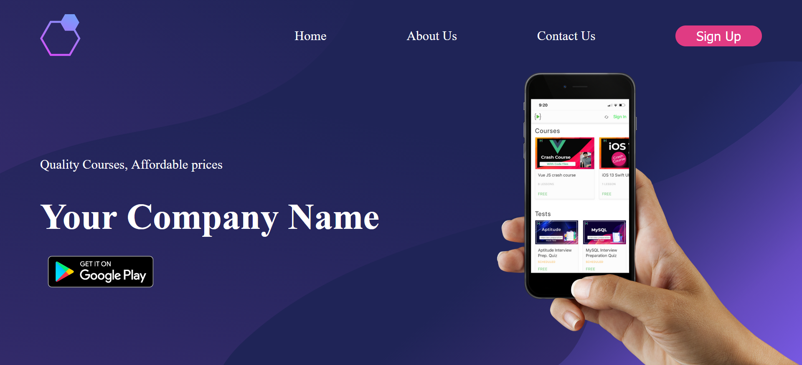

# Basic HTML and CSS ( Project 3 )
### 💻 Website name : `App Landing Page`
 
In this project, I create Simple App Landing Page using Basic of HTML and CSS.

Time : 20 min
 
 

### 👨‍💻 Tech Stack:
* HTML
* CSS
 

### My Solution Link : <a href="https://remarkable-cajeta-5b53f1.netlify.app/" target="_blank"> Website Link</a>
 

### ScreenShot:
 

### PC :

